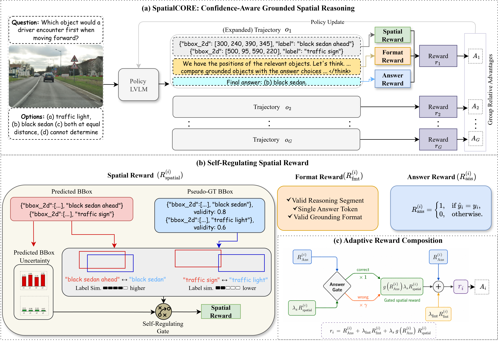

# SpatialCORE
SpatialCORE (Spatially COnfident REasoning), a post-training framework that uses the confidence of the generated grounding as a learning signal for spatial reasoning.

## Abstract
Large Vision-Language Models (LVLMs) have made remarkable progress across visual perception tasks, yet spatial reasoning remains a persistent weakness, especially for questions that require reasoning over visual space. Recent spatial-reasoning methods incorporate generated grounding, where models predict bounding boxes, masks, or other localization outputs for task-relevant objects as part of their reasoning trace. However, these approaches typically optimize for the final answer correctness alone, without checking whether the generated grounding confidently localizes the task-relevant objects. We present SpatialCORE (Spatially COnfident REasoning), a post-training framework that uses the confidence of the generated grounding, i.e., predicted bounding boxes, as a learning signal for spatial reasoning. SpatialCORE introduces a self-regulating spatial reward that modulates each bounding box's reward contribution to the reasoning by its coordinate uncertainty, upweighting confident predictions and downweighting uncertain ones. An answer gate further couples grounding and answer rewards, ensuring spatial optimization is grounded in final-answer correctness. SpatialCORE achieves state-of-the-art results among open-source and specialized spatial reasoning models across diverse benchmarks, and transfers effectively in zero-shot settings to unseen data distributions. The source code is available in the supplementary material.
---

## Architecture



## Requirements

```bash
pip install -r requirements.txt
```

See `requirements.txt` for pinned versions. Key dependencies: `torch==2.10.0`, `transformers==4.57.6`, `trl==1.1.0`, `peft==0.18.1`, `vllm==0.19.0`.

---

## Data

Place datasets at any paths of your choice and update the commands accordingly.

| Dataset | Default path used below |
|---|---|
| OmniSpatial train | `/path/to/OmniSpatial/train/` |
| OmniSpatial test | `/path/to/OmniSpatial/test/` |
| SpatiaLab | `/path/to/SpatiaLab/` |
| Grounding annotations | `/path/to/SpatialCORE/grounding_annotations.json` |


---

## SpatialCORE-8B

> Starts from an SFT-merged checkpoint. Full SFT and merge commands will be added to the GitHub release.

### GRPO Training with Vision LoRA

The vision encoder is trained with LoRA r=4; the LLM decoder with LoRA r=32:

```bash
CUDA_VISIBLE_DEVICES=0,1 torchrun --nproc_per_node=2 spatialCORE_omnispatial_train.py \
  --output_dir /path/to/SpatialCORE/checkpoints/grpo_8b \
  --dataset_name omnispatial \
  --model_name_or_path /path/to/SpatialCORE/checkpoints/sft_8b_merged \
  --per_device_train_batch_size 2 \
  --num_generations 4 \
  --max_completion_length 3072 \
  --bf16 true \
  --gradient_checkpointing true \
  --gradient_checkpointing_kwargs '{"use_reentrant": false}' \
  --beta 0.01 \
  --use_peft true --lora_r 32 --lora_alpha 64 --lora_dropout 0.05 --lora_task_type CAUSAL_LM \
  --train_vision_lora true --vision_lora_r 4 \
  --report_to wandb \
  --learning_rate 5e-5 \
  --warmup_ratio 0.05 \
  --max_steps 1000 \
  --use_vllm true --vllm_mode colocate --vllm_gpu_memory_utilization 0.40 --vllm_max_model_length 16384 \
  --lr_scheduler_type cosine_with_min_lr \
  --lr_scheduler_kwargs '{"min_lr_rate": 0.1}' \
  --gradient_accumulation_steps 8 \
  --grounding_annotations /path/to/SpatialCORE/grounding_annotations.json \
  --no_resume \
  --save_steps 100 --save_total_limit 3 --save_only_model true \
  --logging_steps 1 \
  --grounding_fbeta 2.0 \
  --over_prediction_penalty 0.3 \
  --uncertainty_beta 0.1 \
  --spatial_answer_gate 0.3 \
  --task_types Spatial_Interaction,Perspective_Taking,Complex_Logic
```


### OmniSpatial Evaluation

```bash
python spatialCORE_omnispatial_run.py \
  --model-id /path/to/SpatialCORE/checkpoints/sft_8b_merged \
  --adapter-path /path/to/SpatialCORE/checkpoints/grpo_8b/checkpoint-100 \
  --task-types Spatial_Interaction,Perspective_Taking,Complex_Logic,Dynamic_Reasoning \
  --with-reasoning --use-vllm --batch-size 16 --max-new-tokens 8192 \
  --output logs/spatialcore_8b_omnispatial_eval.jsonl

python spatialCORE_evaluation_omnispatial.py --input logs/spatialcore_8b_omnispatial_eval.jsonl
```

### SpatiaLab Evaluation

```bash
python spatialCORE_spatiallab_run.py \
  --model-id /path/to/SpatialCORE/checkpoints/sft_8b_merged \
  --adapter-path /path/to/SpatialCORE/checkpoints/grpo_8b/checkpoint-100 \
  --with-reasoning --use-vllm --batch-size 16 --max-new-tokens 8192 \
  --output logs/spatialcore_8b_spatiallab_eval.jsonl

python spatialCORE_evaluation_spatiallab.py --input logs/spatialcore_8b_spatiallab_eval.jsonl
```

---

## SpatialCORE-4B

> Starts from an SFT-merged checkpoint.
### GRPO Training with Vision LoRA

```bash
CUDA_VISIBLE_DEVICES=0,1 torchrun --nproc_per_node=2 spatialCORE_omnispatial_train.py \
  --output_dir /path/to/SpatialCORE/checkpoints/grpo_4b \
  --dataset_name omnispatial \
  --model_name_or_path /path/to/SpatialCORE/checkpoints/sft_4b_merged \
  --per_device_train_batch_size 4 \
  --num_generations 4 \
  --max_completion_length 3072 \
  --bf16 true \
  --gradient_checkpointing true \
  --gradient_checkpointing_kwargs '{"use_reentrant": false}' \
  --beta 0.01 \
  --use_peft true --lora_r 32 --lora_alpha 64 --lora_dropout 0.05 --lora_task_type CAUSAL_LM \
  --train_vision_lora true --vision_lora_r 4 \
  --report_to wandb \
  --learning_rate 5e-5 \
  --warmup_ratio 0.05 \
  --max_steps 1500 \
  --use_vllm true --vllm_mode colocate --vllm_gpu_memory_utilization 0.40 --vllm_max_model_length 16384 \
  --lr_scheduler_type cosine_with_min_lr \
  --lr_scheduler_kwargs '{"min_lr_rate": 0.1}' \
  --gradient_accumulation_steps 8 \
  --grounding_annotations /path/to/SpatialCORE/grounding_annotations.json \
  --no_resume \
  --save_steps 100 --save_total_limit 3 --save_only_model true \
  --logging_steps 1 \
  --grounding_fbeta 2.0 \
  --over_prediction_penalty 0.3 \
  --uncertainty_beta 0.1 \
  --spatial_answer_gate 0.3 \
  --task_types Spatial_Interaction,Perspective_Taking,Complex_Logic
```


### OmniSpatial Evaluation

```bash
python spatialCORE_omnispatial_run.py \
  --model-id /path/to/SpatialCORE/checkpoints/sft_4b_merged \
  --adapter-path /path/to/SpatialCORE/checkpoints/grpo_4b/checkpoint-1300 \
  --task-types Spatial_Interaction,Perspective_Taking,Complex_Logic,Dynamic_Reasoning \
  --with-reasoning --use-vllm --batch-size 16 --max-new-tokens 8192 \
  --output logs/spatialcore_4b_omnispatial_eval.jsonl

python spatialCORE_evaluation_omnispatial.py --input logs/spatialcore_4b_omnispatial_eval.jsonl
```

### SpatiaLab Evaluation

```bash
python spatialCORE_spatiallab_run.py \
  --model-id /path/to/SpatialCORE/checkpoints/sft_4b_merged \
  --adapter-path /path/to/SpatialCORE/checkpoints/grpo_4b/checkpoint-1300 \
  --with-reasoning --use-vllm --batch-size 16 --max-new-tokens 8192 \
  --output logs/spatialcore_4b_spatiallab_eval.jsonl

python spatialCORE_evaluation_spatiallab.py --input logs/spatialcore_4b_spatiallab_eval.jsonl
```

---
